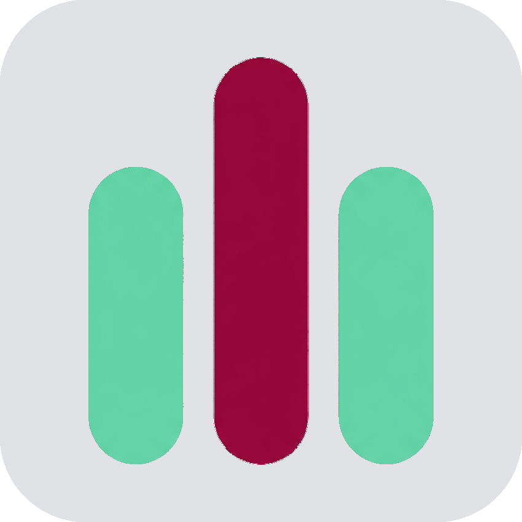
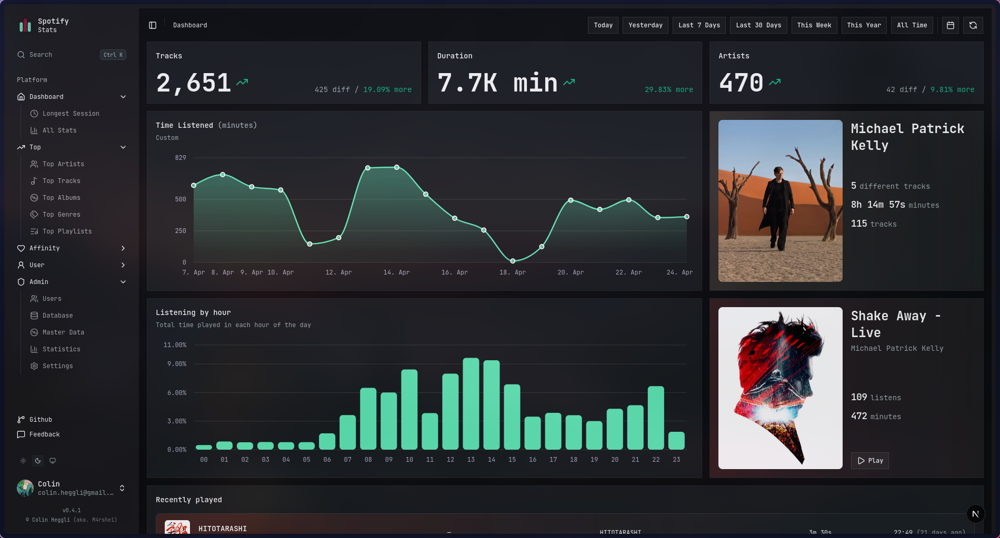
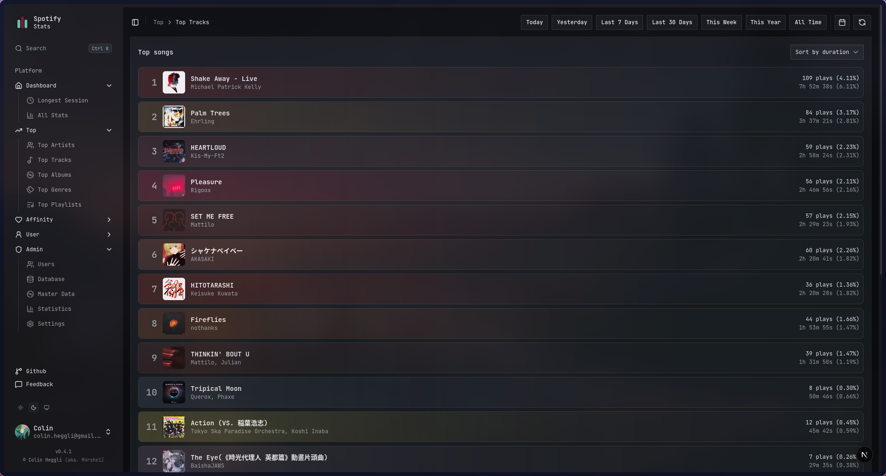
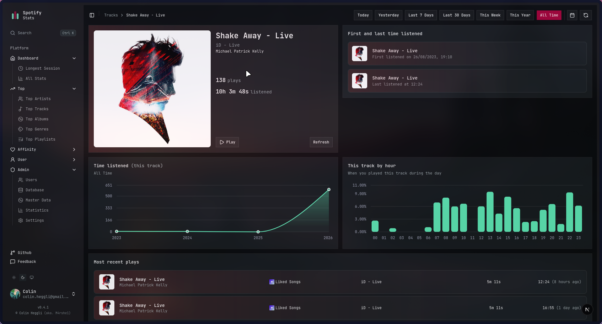

<div align="center">

<picture>
  <source srcSet="public/wave-dark.png" media="(prefers-color-scheme: dark)" />
  
</picture>

# Spotify Stats

**Personal Spotify listening stats** — see how you have changed over the years and discover new patterns in your music taste. Effortlessly track your favorite genres, artists, and songs, analyze trends and listening habits, and visualize your evolution as a Spotify user over time.

[](https://github.com/M4rshe1/spotify-stats/releases/latest)
[](https://bun.sh)
[](https://nextjs.org)

</div>

---

## Table of contents

- [Overview](#overview)
- [Screenshots](#screenshots)
- [Requirements](#requirements)
- [Environment variables](#environment-variables)
- [Docker](#docker)
- [Spotify Developer app (client ID & secret)](#spotify-developer-app-client-id--secret)
- [Requesting extended streaming history](#requesting-extended-streaming-history)
- [Local development (without Docker for the app)](#local-development-without-docker-for-the-app)
- [Contributing & issues](#contributing--issues)

---

## Overview

Spotify Stats is a self-hosted web app built with **Next.js**, **Better Auth** (Spotify sign-in), **Prisma** (PostgreSQL), **Redis**, and **BullMQ** workers for stats and import processing. Users sign in with Spotify, and can upload **Spotify extended streaming history** JSON exports for richer playback data.

<div id="screenshots"></div>

<details>
<summary><strong>Screenshots</strong> — click to expand</summary>

<p align="center"><em>Dashboard</em></p>
<p align="center">
  
</p>

<p align="center"><em>Top tracks</em></p>
<p align="center">
  
</p>

<p align="center"><em>Track</em></p>
<p align="center">
  
</p>

</details>

---

## Requirements

- [Bun](https://bun.sh) (see `package.json` / lockfile)
- **PostgreSQL** and **Redis** (included in Docker Compose)
- A **Spotify Developer** application (see below)

---

## Environment variables

Copy `.env.example` to `.env` and fill in values. The authoritative schema lives in [`src/env.js`](./src/env.js).

| Variable                            | Required   | Description                                                                                                                |
| ----------------------------------- | ---------- | -------------------------------------------------------------------------------------------------------------------------- |
| `BETTER_AUTH_SECRET`                | Production | Secret for Better Auth session/crypto. Optional in development.                                                            |
| `BETTER_AUTH_URL`                   | Yes        | Public base URL of the app (e.g. `http://localhost:3000` or `https://stats.example.com`). Used for OAuth callbacks.        |
| `BETTER_AUTH_SPOTIFY_CLIENT_ID`     | Yes        | Spotify app **Client ID** from the Developer Dashboard.                                                                    |
| `BETTER_AUTH_SPOTIFY_CLIENT_SECRET` | Yes        | Spotify app **Client secret**.                                                                                             |
| `BETTER_AUTH_GOOGLE_CLIENT_ID`      | No         | Google OAuth (optional; linking/sign-in for existing users).                                                               |
| `BETTER_AUTH_GOOGLE_CLIENT_SECRET`  | No         | Google OAuth client secret.                                                                                                |
| `DATABASE_URL`                      | Yes        | PostgreSQL connection URL (must be a valid URL per validation).                                                            |
| `REDIS_URL`                         | Yes        | Redis connection URL (e.g. `redis://localhost:6379` or `redis://redis:6379` in Docker).                                    |
| `TZ`                                | Yes        | [IANA time zone](https://en.wikipedia.org/wiki/List_of_tz_database_time_zones) (e.g. `Europe/Zurich`, `America/New_York`). |
| `NODE_ENV`                          | Optional   | `development` \| `test` \| `production` (defaults to `development`).                                                       |

**Build-only / Docker:** you can set `SKIP_ENV_VALIDATION=1` during image build so Next.js does not require a full `.env` at build time (see [`Dockerfile`](./Dockerfile)).

---

## Docker

There are multiple options for running the app with Docker. The recommended way is to use the prebuilt image from the GitHub Container Registry.

### Option A — Prebuilt image (default `docker-compose.yml`)

Uses `ghcr.io/m4rshe1/spotify-stats:latest` plus Postgres and Redis.

1. Copy the docker-compose.yml file to your deployment directory and create a .env file with the environment variables (see [Environment variables](#environment-variables)).

2. From the deployment directory:

   ```bash
   docker compose up -d
   ```

### Option B — Build locally (`docker-compose.build.yml`)

Same as Option A, but builds the image from this repository:

1. Clone the repo and create `.env` (see [Environment variables](#environment-variables)).

2. From the deployment directory:

```bash
docker compose -f docker-compose.build.yml up -d --build
```

## Spotify Developer app (client ID & secret)

1. Open the [Spotify Developer Dashboard](https://developer.spotify.com/dashboard) and log in.
2. Click **Create app**. Pick a name and description; set the **Redirect URI** to:

   ```text
   {BETTER_AUTH_URL}/api/auth/callback/spotify
   ```

   Replace `{BETTER_AUTH_URL}` with your real base URL, **no trailing slash**, e.g. `https://stats.example.com/api/auth/callback/spotify`

3. Save the app, then open **Settings** and copy **Client ID** and **Client secret** into `.env`:
   - `BETTER_AUTH_SPOTIFY_CLIENT_ID`
   - `BETTER_AUTH_SPOTIFY_CLIENT_SECRET`

4. The app requests the scopes defined in [`src/server/better-auth/config.ts`](./src/server/better-auth/config.ts) (library, playlists, playback state, recently played, user profile, etc.). If Spotify asks you to justify scopes for extension/review, describe personal stats and playback features only.

---

## Requesting extended streaming history

Extended history is **not** available through the Web API alone; Spotify delivers it as a **privacy data export** (JSON files you upload into this app).

1. Go to **[Spotify account privacy](https://www.spotify.com/account/privacy/)** (Account → Privacy settings; region-specific URLs may redirect).
2. Find **Download your data** (or equivalent) and request an export.
3. Select **Extended streaming history** (and any other packages you want). Confirm the request.
4. Spotify emails you when the package is ready (often **several days**).
5. Download the ZIP, extract it, and locate JSON files whose content is a **JSON array** of stream objects (Spotify typically names them like `Streaming_History_audio_*.json`)
6. In Spotify Stats, click on the import link under the user section in the navigation bar on the left side

If an upload fails, check that each file is valid JSON and the **top-level value is an array** (as Spotify’s extended history files are).

## Local development (without Docker for the app)

1. Start Postgres and Redis (e.g. `docker compose -f docker-compose.dev.yml up -d` if that matches your machine — adjust credentials in `.env` to match).
2. `bun install`
3. Copy `.env.example` → `.env` and set all required variables for [`src/env.js`](./src/env.js).
4. Apply migrations: `bun run db:migrate` (or `db:generate` during schema work).
5. Run the app: `bun run dev`
6. In separate terminals, run `bun run worker:stats` and `bun run worker:cruncher` so imports and background jobs complete.

## Contributing & issues

Contributions are welcome: **fork → branch → PR** with a clear description of behavior and any migration or env changes.

- **Bug reports & feature requests:** [GitHub Issues](https://github.com/M4rshe1/spotify-stats/issues)
- Before opening an issue, check existing threads and include OS, Bun version, and relevant logs (without secrets).

## Technical limitations

- Data histoy is only available through a privacy data export from Spotify.
- Some Data is not available through the Spotify Web API.
- Some Data is only available through the Spotify API and not included in the privacy data export.

## License

This project is licensed under the [Creative Commons Attribution-NonCommercial 4.0 International Public License](./LICENSE).

## Acknowledgments

Built with Spotify’s public APIs and privacy exports for personal analytics.

This project was heavily inspired by [your_spotify](https://github.com/Yooooomi/your_spotify) from [Yooooomi](https://github.com/Yooooomi). Thanks to [Yooooomi](https://github.com/Yooooomi) for the inspiration and for creating your_spotify.

## Star History

<a href="https://www.star-history.com/?repos=m4rshe1%2Fspotify-stats&type=date&legend=top-left">
 <picture>
   <source media="(prefers-color-scheme: dark)" srcset="https://api.star-history.com/chart?repos=m4rshe1/spotify-stats&type=date&theme=dark&legend=top-left" />
   <source media="(prefers-color-scheme: light)" srcset="https://api.star-history.com/chart?repos=m4rshe1/spotify-stats&type=date&legend=top-left" />
   
 </picture>
</a>
